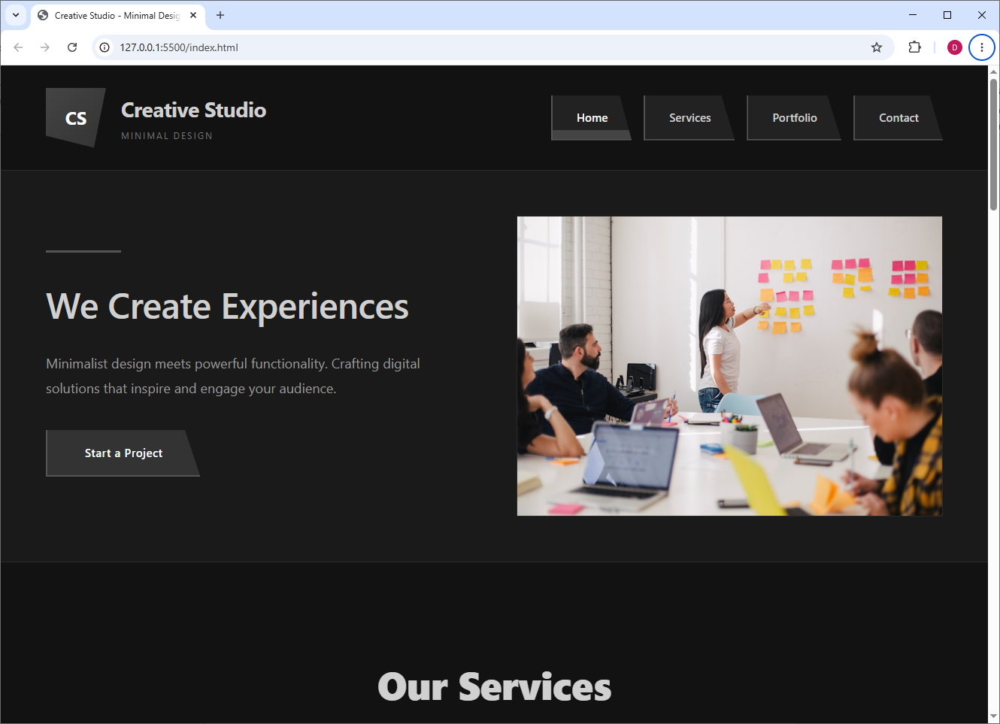
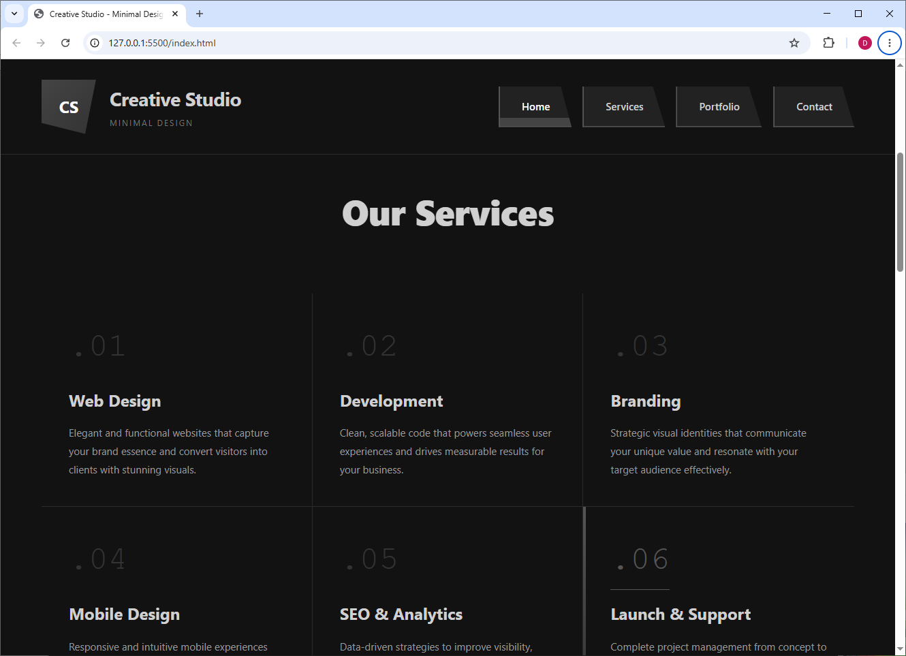
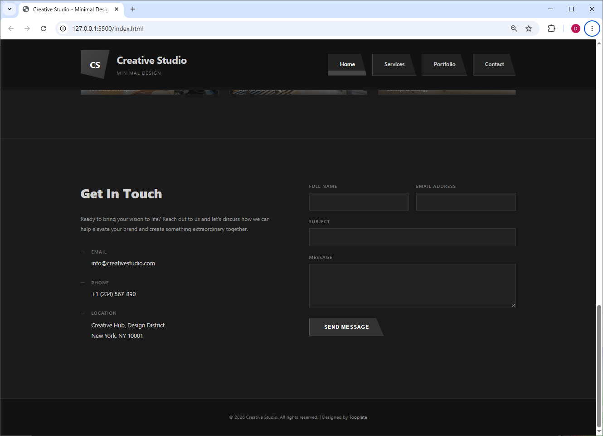

# Primer Parcial — Programación Estática y Laboratorio Web

Primer parcial de **Programación Estática y Laboratorio Web** resuelto y aprobado.


## 📌 ¿Qué es?

Resolución del primer parcial de la materia, desarrollado en HTML y CSS. Incluye el enunciado y las capturas de los resultados esperados.

## 🗂️ Estructura

| Archivo | Descripción |
|---------|-------------|
| `index.html` | Página principal del parcial. |
| `estilos.css` | Hoja de estilos. |
| `resultado1.png` – `resultado3.png` | Capturas de los resultados esperados. |
| `Indicaciones1.pdf` / `.docx` | Enunciado del parcial. |

## 📸 Capturas







## ▶️ Cómo ejecutarlo

Abre `index.html` en tu navegador, o levanta un servidor local:

```bash
npx serve
```
